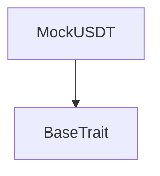
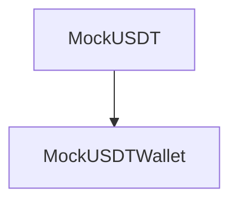

# Tact compilation report
Contract: MockUSDT
BoC Size: 2144 bytes

## Structures (Structs and Messages)
Total structures: 21

### DataSize
TL-B: `_ cells:int257 bits:int257 refs:int257 = DataSize`
Signature: `DataSize{cells:int257,bits:int257,refs:int257}`

### SignedBundle
TL-B: `_ signature:fixed_bytes64 signedData:remainder<slice> = SignedBundle`
Signature: `SignedBundle{signature:fixed_bytes64,signedData:remainder<slice>}`

### StateInit
TL-B: `_ code:^cell data:^cell = StateInit`
Signature: `StateInit{code:^cell,data:^cell}`

### Context
TL-B: `_ bounceable:bool sender:address value:int257 raw:^slice = Context`
Signature: `Context{bounceable:bool,sender:address,value:int257,raw:^slice}`

### SendParameters
TL-B: `_ mode:int257 body:Maybe ^cell code:Maybe ^cell data:Maybe ^cell value:int257 to:address bounce:bool = SendParameters`
Signature: `SendParameters{mode:int257,body:Maybe ^cell,code:Maybe ^cell,data:Maybe ^cell,value:int257,to:address,bounce:bool}`

### MessageParameters
TL-B: `_ mode:int257 body:Maybe ^cell value:int257 to:address bounce:bool = MessageParameters`
Signature: `MessageParameters{mode:int257,body:Maybe ^cell,value:int257,to:address,bounce:bool}`

### DeployParameters
TL-B: `_ mode:int257 body:Maybe ^cell value:int257 bounce:bool init:StateInit{code:^cell,data:^cell} = DeployParameters`
Signature: `DeployParameters{mode:int257,body:Maybe ^cell,value:int257,bounce:bool,init:StateInit{code:^cell,data:^cell}}`

### StdAddress
TL-B: `_ workchain:int8 address:uint256 = StdAddress`
Signature: `StdAddress{workchain:int8,address:uint256}`

### VarAddress
TL-B: `_ workchain:int32 address:^slice = VarAddress`
Signature: `VarAddress{workchain:int32,address:^slice}`

### BasechainAddress
TL-B: `_ hash:Maybe int257 = BasechainAddress`
Signature: `BasechainAddress{hash:Maybe int257}`

### JettonTransfer
TL-B: `jetton_transfer#0f8a7ea5 query_id:uint64 amount:coins destination:address response_destination:address custom_payload:Maybe ^cell forward_ton_amount:coins forward_payload:remainder<slice> = JettonTransfer`
Signature: `JettonTransfer{query_id:uint64,amount:coins,destination:address,response_destination:address,custom_payload:Maybe ^cell,forward_ton_amount:coins,forward_payload:remainder<slice>}`

### JettonTransferNotification
TL-B: `jetton_transfer_notification#178d4519 query_id:uint64 amount:coins sender:address forward_payload:remainder<slice> = JettonTransferNotification`
Signature: `JettonTransferNotification{query_id:uint64,amount:coins,sender:address,forward_payload:remainder<slice>}`

### JettonBurn
TL-B: `jetton_burn#595f07bc query_id:uint64 amount:coins response_destination:address custom_payload:Maybe ^cell = JettonBurn`
Signature: `JettonBurn{query_id:uint64,amount:coins,response_destination:address,custom_payload:Maybe ^cell}`

### JettonBurnNotification
TL-B: `jetton_burn_notification#7bdd97de query_id:uint64 amount:coins sender:address response_destination:address = JettonBurnNotification`
Signature: `JettonBurnNotification{query_id:uint64,amount:coins,sender:address,response_destination:address}`

### JettonExcesses
TL-B: `jetton_excesses#d53276db query_id:uint64 = JettonExcesses`
Signature: `JettonExcesses{query_id:uint64}`

### JettonProvideWalletAddress
TL-B: `jetton_provide_wallet_address#2c76b973 query_id:uint64 owner_address:address include_address:bool = JettonProvideWalletAddress`
Signature: `JettonProvideWalletAddress{query_id:uint64,owner_address:address,include_address:bool}`

### JettonTakeWalletAddress
TL-B: `jetton_take_wallet_address#d1735400 query_id:uint64 wallet_address:address owner_address:address = JettonTakeWalletAddress`
Signature: `JettonTakeWalletAddress{query_id:uint64,wallet_address:address,owner_address:address}`

### FaucetRequest
TL-B: `faucet_request#00fa5ce7 query_id:uint64 = FaucetRequest`
Signature: `FaucetRequest{query_id:uint64}`

### AdminMint
TL-B: `admin_mint#000ad4d1 query_id:uint64 receiver:address amount:coins = AdminMint`
Signature: `AdminMint{query_id:uint64,receiver:address,amount:coins}`

### MockUSDTWallet$Data
TL-B: `_ balance:coins owner:address jetton_master:address = MockUSDTWallet`
Signature: `MockUSDTWallet{balance:coins,owner:address,jetton_master:address}`

### MockUSDT$Data
TL-B: `_ total_supply:coins owner:address faucet_claims:uint64 = MockUSDT`
Signature: `MockUSDT{total_supply:coins,owner:address,faucet_claims:uint64}`

## Get methods
Total get methods: 7

## total_supply
No arguments

## decimals
No arguments

## faucet_amount
No arguments

## faucet_claims
No arguments

## owner
No arguments

## get_wallet_address
Argument: owner

## get_jetton_data
No arguments

## Exit codes
* 2: Stack underflow
* 3: Stack overflow
* 4: Integer overflow
* 5: Integer out of expected range
* 6: Invalid opcode
* 7: Type check error
* 8: Cell overflow
* 9: Cell underflow
* 10: Dictionary error
* 11: 'Unknown' error
* 12: Fatal error
* 13: Out of gas error
* 14: Virtualization error
* 32: Action list is invalid
* 33: Action list is too long
* 34: Action is invalid or not supported
* 35: Invalid source address in outbound message
* 36: Invalid destination address in outbound message
* 37: Not enough Toncoin
* 38: Not enough extra currencies
* 39: Outbound message does not fit into a cell after rewriting
* 40: Cannot process a message
* 41: Library reference is null
* 42: Library change action error
* 43: Exceeded maximum number of cells in the library or the maximum depth of the Merkle tree
* 50: Account state size exceeded limits
* 128: Null reference exception
* 129: Invalid serialization prefix
* 130: Invalid incoming message
* 131: Constraints error
* 132: Access denied
* 133: Contract stopped
* 134: Invalid argument
* 135: Code of a contract was not found
* 136: Invalid standard address
* 138: Not a basechain address
* 11246: Send at least 0.05 TON
* 12241: Max supply exceeded
* 14534: Not owner
* 23880: Send at least 0.05 TON for gas
* 35499: Only owner
* 36088: Invalid wallet
* 49729: Unauthorized
* 54615: Insufficient balance

## Trait inheritance diagram

## Contract dependency diagram

