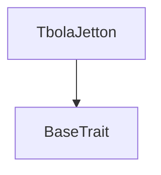
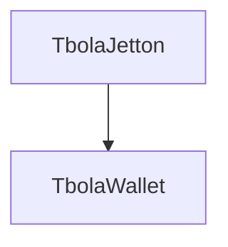

# Tact compilation report
Contract: TbolaJetton
BoC Size: 3631 bytes

## Structures (Structs and Messages)
Total structures: 20

### DataSize
TL-B: `_ cells:int257 bits:int257 refs:int257 = DataSize`
Signature: `DataSize{cells:int257,bits:int257,refs:int257}`

### SignedBundle
TL-B: `_ signature:fixed_bytes64 signedData:remainder<slice> = SignedBundle`
Signature: `SignedBundle{signature:fixed_bytes64,signedData:remainder<slice>}`

### StateInit
TL-B: `_ code:^cell data:^cell = StateInit`
Signature: `StateInit{code:^cell,data:^cell}`

### Context
TL-B: `_ bounceable:bool sender:address value:int257 raw:^slice = Context`
Signature: `Context{bounceable:bool,sender:address,value:int257,raw:^slice}`

### SendParameters
TL-B: `_ mode:int257 body:Maybe ^cell code:Maybe ^cell data:Maybe ^cell value:int257 to:address bounce:bool = SendParameters`
Signature: `SendParameters{mode:int257,body:Maybe ^cell,code:Maybe ^cell,data:Maybe ^cell,value:int257,to:address,bounce:bool}`

### MessageParameters
TL-B: `_ mode:int257 body:Maybe ^cell value:int257 to:address bounce:bool = MessageParameters`
Signature: `MessageParameters{mode:int257,body:Maybe ^cell,value:int257,to:address,bounce:bool}`

### DeployParameters
TL-B: `_ mode:int257 body:Maybe ^cell value:int257 bounce:bool init:StateInit{code:^cell,data:^cell} = DeployParameters`
Signature: `DeployParameters{mode:int257,body:Maybe ^cell,value:int257,bounce:bool,init:StateInit{code:^cell,data:^cell}}`

### StdAddress
TL-B: `_ workchain:int8 address:uint256 = StdAddress`
Signature: `StdAddress{workchain:int8,address:uint256}`

### VarAddress
TL-B: `_ workchain:int32 address:^slice = VarAddress`
Signature: `VarAddress{workchain:int32,address:^slice}`

### BasechainAddress
TL-B: `_ hash:Maybe int257 = BasechainAddress`
Signature: `BasechainAddress{hash:Maybe int257}`

### Transfer
TL-B: `transfer#0f8a7ea5 query_id:uint64 amount:coins destination:address response_destination:address custom_payload:Maybe ^cell forward_ton_amount:coins forward_payload:remainder<slice> = Transfer`
Signature: `Transfer{query_id:uint64,amount:coins,destination:address,response_destination:address,custom_payload:Maybe ^cell,forward_ton_amount:coins,forward_payload:remainder<slice>}`

### TransferNotification
TL-B: `transfer_notification#178d4519 query_id:uint64 amount:coins sender:address forward_payload:remainder<slice> = TransferNotification`
Signature: `TransferNotification{query_id:uint64,amount:coins,sender:address,forward_payload:remainder<slice>}`

### Burn
TL-B: `burn#595f07bc query_id:uint64 amount:coins response_destination:address custom_payload:Maybe ^cell = Burn`
Signature: `Burn{query_id:uint64,amount:coins,response_destination:address,custom_payload:Maybe ^cell}`

### BurnNotification
TL-B: `burn_notification#7bdd97de query_id:uint64 amount:coins sender:address response_destination:address = BurnNotification`
Signature: `BurnNotification{query_id:uint64,amount:coins,sender:address,response_destination:address}`

### Excesses
TL-B: `excesses#d53276db query_id:uint64 = Excesses`
Signature: `Excesses{query_id:uint64}`

### ProvideWalletAddress
TL-B: `provide_wallet_address#2c76b973 query_id:uint64 owner_address:address include_address:bool = ProvideWalletAddress`
Signature: `ProvideWalletAddress{query_id:uint64,owner_address:address,include_address:bool}`

### TakeWalletAddress
TL-B: `take_wallet_address#d1735400 query_id:uint64 wallet_address:address owner_address:address = TakeWalletAddress`
Signature: `TakeWalletAddress{query_id:uint64,wallet_address:address,owner_address:address}`

### Mint
TL-B: `mint#642b7d07 query_id:uint64 amount:coins receiver:address = Mint`
Signature: `Mint{query_id:uint64,amount:coins,receiver:address}`

### TbolaWallet$Data
TL-B: `_ balance:coins owner:address jetton_master:address = TbolaWallet`
Signature: `TbolaWallet{balance:coins,owner:address,jetton_master:address}`

### TbolaJetton$Data
TL-B: `_ total_supply:coins mintable:bool owner:address minted_airdrop:coins minted_presale:coins minted_liquidity:coins minted_team:coins minted_marketing:coins minted_reserve:coins presale_wallet:address liquidity_wallet:address team_wallet:address marketing_wallet:address reserve_wallet:address team_vesting_start:uint32 team_vesting_claimed:coins = TbolaJetton`
Signature: `TbolaJetton{total_supply:coins,mintable:bool,owner:address,minted_airdrop:coins,minted_presale:coins,minted_liquidity:coins,minted_team:coins,minted_marketing:coins,minted_reserve:coins,presale_wallet:address,liquidity_wallet:address,team_wallet:address,marketing_wallet:address,reserve_wallet:address,team_vesting_start:uint32,team_vesting_claimed:coins}`

## Get methods
Total get methods: 10

## get_jetton_data
No arguments

## total_supply
No arguments

## mintable
No arguments

## owner
No arguments

## minted_airdrop
No arguments

## minted_presale
No arguments

## minted_team
No arguments

## circulating_supply
No arguments

## get_wallet_address
Argument: owner

## vesting_claimable
No arguments

## Exit codes
* 2: Stack underflow
* 3: Stack overflow
* 4: Integer overflow
* 5: Integer out of expected range
* 6: Invalid opcode
* 7: Type check error
* 8: Cell overflow
* 9: Cell underflow
* 10: Dictionary error
* 11: 'Unknown' error
* 12: Fatal error
* 13: Out of gas error
* 14: Virtualization error
* 32: Action list is invalid
* 33: Action list is too long
* 34: Action is invalid or not supported
* 35: Invalid source address in outbound message
* 36: Invalid destination address in outbound message
* 37: Not enough Toncoin
* 38: Not enough extra currencies
* 39: Outbound message does not fit into a cell after rewriting
* 40: Cannot process a message
* 41: Library reference is null
* 42: Library change action error
* 43: Exceeded maximum number of cells in the library or the maximum depth of the Merkle tree
* 50: Account state size exceeded limits
* 128: Null reference exception
* 129: Invalid serialization prefix
* 130: Invalid incoming message
* 131: Constraints error
* 132: Access denied
* 133: Contract stopped
* 134: Invalid argument
* 135: Code of a contract was not found
* 136: Invalid standard address
* 138: Not a basechain address
* 1630: Cliff period not reached
* 9050: Already distributed
* 14534: Not owner
* 23404: Invalid sender wallet
* 35499: Only owner
* 36088: Invalid wallet
* 44799: Nothing to claim
* 49729: Unauthorized
* 51916: Vesting not started
* 54615: Insufficient balance
* 56184: Only team wallet
* 56249: Airdrop cap exceeded
* 56760: Minting disabled
* 57579: Only owner can mint

## Trait inheritance diagram

## Contract dependency diagram

