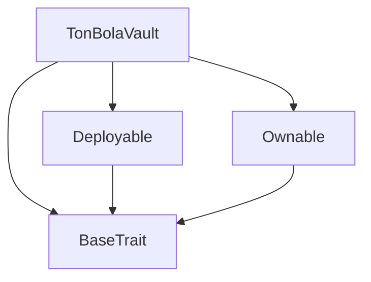
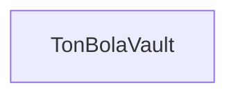

# Tact compilation report
Contract: TonBolaVault
BoC Size: 3483 bytes

## Structures (Structs and Messages)
Total structures: 23

### DataSize
TL-B: `_ cells:int257 bits:int257 refs:int257 = DataSize`
Signature: `DataSize{cells:int257,bits:int257,refs:int257}`

### SignedBundle
TL-B: `_ signature:fixed_bytes64 signedData:remainder<slice> = SignedBundle`
Signature: `SignedBundle{signature:fixed_bytes64,signedData:remainder<slice>}`

### StateInit
TL-B: `_ code:^cell data:^cell = StateInit`
Signature: `StateInit{code:^cell,data:^cell}`

### Context
TL-B: `_ bounceable:bool sender:address value:int257 raw:^slice = Context`
Signature: `Context{bounceable:bool,sender:address,value:int257,raw:^slice}`

### SendParameters
TL-B: `_ mode:int257 body:Maybe ^cell code:Maybe ^cell data:Maybe ^cell value:int257 to:address bounce:bool = SendParameters`
Signature: `SendParameters{mode:int257,body:Maybe ^cell,code:Maybe ^cell,data:Maybe ^cell,value:int257,to:address,bounce:bool}`

### MessageParameters
TL-B: `_ mode:int257 body:Maybe ^cell value:int257 to:address bounce:bool = MessageParameters`
Signature: `MessageParameters{mode:int257,body:Maybe ^cell,value:int257,to:address,bounce:bool}`

### DeployParameters
TL-B: `_ mode:int257 body:Maybe ^cell value:int257 bounce:bool init:StateInit{code:^cell,data:^cell} = DeployParameters`
Signature: `DeployParameters{mode:int257,body:Maybe ^cell,value:int257,bounce:bool,init:StateInit{code:^cell,data:^cell}}`

### StdAddress
TL-B: `_ workchain:int8 address:uint256 = StdAddress`
Signature: `StdAddress{workchain:int8,address:uint256}`

### VarAddress
TL-B: `_ workchain:int32 address:^slice = VarAddress`
Signature: `VarAddress{workchain:int32,address:^slice}`

### BasechainAddress
TL-B: `_ hash:Maybe int257 = BasechainAddress`
Signature: `BasechainAddress{hash:Maybe int257}`

### Deploy
TL-B: `deploy#946a98b6 queryId:uint64 = Deploy`
Signature: `Deploy{queryId:uint64}`

### DeployOk
TL-B: `deploy_ok#aff90f57 queryId:uint64 = DeployOk`
Signature: `DeployOk{queryId:uint64}`

### FactoryDeploy
TL-B: `factory_deploy#6d0ff13b queryId:uint64 cashback:address = FactoryDeploy`
Signature: `FactoryDeploy{queryId:uint64,cashback:address}`

### ChangeOwner
TL-B: `change_owner#819dbe99 queryId:uint64 newOwner:address = ChangeOwner`
Signature: `ChangeOwner{queryId:uint64,newOwner:address}`

### ChangeOwnerOk
TL-B: `change_owner_ok#327b2b4a queryId:uint64 newOwner:address = ChangeOwnerOk`
Signature: `ChangeOwnerOk{queryId:uint64,newOwner:address}`

### GamePayment
TL-B: `game_payment#00000001 game_type:uint8 game_id:uint64 = GamePayment`
Signature: `GamePayment{game_type:uint8,game_id:uint64}`

### PayWinner
TL-B: `pay_winner#00000002 game_id:uint64 winner:address amount:coins win_type:uint8 = PayWinner`
Signature: `PayWinner{game_id:uint64,winner:address,amount:coins,win_type:uint8}`

### PayRank
TL-B: `pay_rank#00000003 rank_type:uint8 period_key:uint64 w1:address a1:coins w2:address a2:coins w3:address a3:coins w4:address a4:coins w5:address a5:coins = PayRank`
Signature: `PayRank{rank_type:uint8,period_key:uint64,w1:address,a1:coins,w2:address,a2:coins,w3:address,a3:coins,w4:address,a4:coins,w5:address,a5:coins}`

### JackpotPayout
TL-B: `jackpot_payout#00000004 game_type:uint8 winner:address amount:coins = JackpotPayout`
Signature: `JackpotPayout{game_type:uint8,winner:address,amount:coins}`

### SetOracle
TL-B: `set_oracle#00000005 oracle:address = SetOracle`
Signature: `SetOracle{oracle:address}`

### WithdrawDev
TL-B: `withdraw_dev#00000006 amount:coins = WithdrawDev`
Signature: `WithdrawDev{amount:coins}`

### GamePool
TL-B: `_ amount:coins game_type:uint8 paid_out:bool = GamePool`
Signature: `GamePool{amount:coins,game_type:uint8,paid_out:bool}`

### TonBolaVault$Data
TL-B: `_ owner:address oracle:address game_pools:dict<int, ^GamePool{amount:coins,game_type:uint8,paid_out:bool}> jackpot_bingo:coins jackpot_wheel:coins jackpot_scratch:coins rank_weekly_ind:coins rank_monthly_ind:coins rank_weekly_squad:coins rank_monthly_squad:coins dev_balance:coins total_processed:coins paid_periods:dict<int, bool> = TonBolaVault`
Signature: `TonBolaVault{owner:address,oracle:address,game_pools:dict<int, ^GamePool{amount:coins,game_type:uint8,paid_out:bool}>,jackpot_bingo:coins,jackpot_wheel:coins,jackpot_scratch:coins,rank_weekly_ind:coins,rank_monthly_ind:coins,rank_weekly_squad:coins,rank_monthly_squad:coins,dev_balance:coins,total_processed:coins,paid_periods:dict<int, bool>}`

## Get methods
Total get methods: 13

## getPool
Argument: game_id

## jackpotBingo
No arguments

## jackpotWheel
No arguments

## jackpotScratch
No arguments

## rankWeeklyInd
No arguments

## rankMonthlyInd
No arguments

## rankWeeklySquad
No arguments

## rankMonthlySquad
No arguments

## devBalance
No arguments

## totalProcessed
No arguments

## oracle
No arguments

## balance
No arguments

## owner
No arguments

## Exit codes
* 2: Stack underflow
* 3: Stack overflow
* 4: Integer overflow
* 5: Integer out of expected range
* 6: Invalid opcode
* 7: Type check error
* 8: Cell overflow
* 9: Cell underflow
* 10: Dictionary error
* 11: 'Unknown' error
* 12: Fatal error
* 13: Out of gas error
* 14: Virtualization error
* 32: Action list is invalid
* 33: Action list is too long
* 34: Action is invalid or not supported
* 35: Invalid source address in outbound message
* 36: Invalid destination address in outbound message
* 37: Not enough Toncoin
* 38: Not enough extra currencies
* 39: Outbound message does not fit into a cell after rewriting
* 40: Cannot process a message
* 41: Library reference is null
* 42: Library change action error
* 43: Exceeded maximum number of cells in the library or the maximum depth of the Merkle tree
* 50: Account state size exceeded limits
* 128: Null reference exception
* 129: Invalid serialization prefix
* 130: Invalid incoming message
* 131: Constraints error
* 132: Access denied
* 133: Contract stopped
* 134: Invalid argument
* 135: Code of a contract was not found
* 136: Invalid standard address
* 138: Not a basechain address
* 4151: Exceeds pool
* 7043: Below 5 TON threshold
* 8580: Empty pool
* 11026: Already paid
* 12043: Pool not found
* 14319: Exceeds dev balance
* 17062: Invalid amount
* 18343: Low balance
* 21831: Period already paid
* 29474: Only oracle
* 42669: Exceeds jackpot
* 47290: Min 0.01 TON

## Trait inheritance diagram

## Contract dependency diagram

