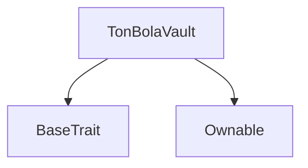
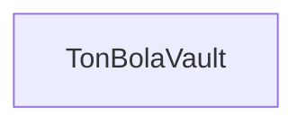

# Tact compilation report
Contract: TonBolaVault
BoC Size: 2351 bytes

## Structures (Structs and Messages)
Total structures: 16

### DataSize
TL-B: `_ cells:int257 bits:int257 refs:int257 = DataSize`
Signature: `DataSize{cells:int257,bits:int257,refs:int257}`

### SignedBundle
TL-B: `_ signature:fixed_bytes64 signedData:remainder<slice> = SignedBundle`
Signature: `SignedBundle{signature:fixed_bytes64,signedData:remainder<slice>}`

### StateInit
TL-B: `_ code:^cell data:^cell = StateInit`
Signature: `StateInit{code:^cell,data:^cell}`

### Context
TL-B: `_ bounceable:bool sender:address value:int257 raw:^slice = Context`
Signature: `Context{bounceable:bool,sender:address,value:int257,raw:^slice}`

### SendParameters
TL-B: `_ mode:int257 body:Maybe ^cell code:Maybe ^cell data:Maybe ^cell value:int257 to:address bounce:bool = SendParameters`
Signature: `SendParameters{mode:int257,body:Maybe ^cell,code:Maybe ^cell,data:Maybe ^cell,value:int257,to:address,bounce:bool}`

### MessageParameters
TL-B: `_ mode:int257 body:Maybe ^cell value:int257 to:address bounce:bool = MessageParameters`
Signature: `MessageParameters{mode:int257,body:Maybe ^cell,value:int257,to:address,bounce:bool}`

### DeployParameters
TL-B: `_ mode:int257 body:Maybe ^cell value:int257 bounce:bool init:StateInit{code:^cell,data:^cell} = DeployParameters`
Signature: `DeployParameters{mode:int257,body:Maybe ^cell,value:int257,bounce:bool,init:StateInit{code:^cell,data:^cell}}`

### StdAddress
TL-B: `_ workchain:int8 address:uint256 = StdAddress`
Signature: `StdAddress{workchain:int8,address:uint256}`

### VarAddress
TL-B: `_ workchain:int32 address:^slice = VarAddress`
Signature: `VarAddress{workchain:int32,address:^slice}`

### BasechainAddress
TL-B: `_ hash:Maybe int257 = BasechainAddress`
Signature: `BasechainAddress{hash:Maybe int257}`

### GamePayment
TL-B: `game_payment#47696d70 game_type:uint8 game_id:uint64 player_id:uint64 = GamePayment`
Signature: `GamePayment{game_type:uint8,game_id:uint64,player_id:uint64}`

### PayWinner
TL-B: `pay_winner#50617957 winner:address amount:coins game_id:uint64 nonce:uint64 signature:^slice = PayWinner`
Signature: `PayWinner{winner:address,amount:coins,game_id:uint64,nonce:uint64,signature:^slice}`

### PayJackpot
TL-B: `pay_jackpot#4a61636b winner:address pool_id:uint8 nonce:uint64 signature:^slice = PayJackpot`
Signature: `PayJackpot{winner:address,pool_id:uint8,nonce:uint64,signature:^slice}`

### UpdateConfig
TL-B: `update_config#436f6e66 dev_wallet:address token_fund:address leaderboard_wallet:address platform_wallet:address oracle_pubkey:uint256 = UpdateConfig`
Signature: `UpdateConfig{dev_wallet:address,token_fund:address,leaderboard_wallet:address,platform_wallet:address,oracle_pubkey:uint256}`

### WinnerPaid
TL-B: `winner_paid#c3f21467 winner:address amount:coins game_id:uint64 = WinnerPaid`
Signature: `WinnerPaid{winner:address,amount:coins,game_id:uint64}`

### TonBolaVault$Data
TL-B: `_ owner:address dev_wallet:address token_fund:address leaderboard_wallet:address platform_wallet:address oracle_pubkey:uint256 last_nonce:uint64 jackpot_ton:coins total_in:coins total_paid:coins game_count:uint64 prize_pool:coins = TonBolaVault`
Signature: `TonBolaVault{owner:address,dev_wallet:address,token_fund:address,leaderboard_wallet:address,platform_wallet:address,oracle_pubkey:uint256,last_nonce:uint64,jackpot_ton:coins,total_in:coins,total_paid:coins,game_count:uint64,prize_pool:coins}`

## Get methods
Total get methods: 8

## balance
No arguments

## prizePool
No arguments

## jackpotTon
No arguments

## totalIn
No arguments

## totalPaid
No arguments

## gameCount
No arguments

## lastNonce
No arguments

## owner
No arguments

## Exit codes
* 2: Stack underflow
* 3: Stack overflow
* 4: Integer overflow
* 5: Integer out of expected range
* 6: Invalid opcode
* 7: Type check error
* 8: Cell overflow
* 9: Cell underflow
* 10: Dictionary error
* 11: 'Unknown' error
* 12: Fatal error
* 13: Out of gas error
* 14: Virtualization error
* 32: Action list is invalid
* 33: Action list is too long
* 34: Action is invalid or not supported
* 35: Invalid source address in outbound message
* 36: Invalid destination address in outbound message
* 37: Not enough Toncoin
* 38: Not enough extra currencies
* 39: Outbound message does not fit into a cell after rewriting
* 40: Cannot process a message
* 41: Library reference is null
* 42: Library change action error
* 43: Exceeded maximum number of cells in the library or the maximum depth of the Merkle tree
* 50: Account state size exceeded limits
* 128: Null reference exception
* 129: Invalid serialization prefix
* 130: Invalid incoming message
* 131: Constraints error
* 132: Access denied
* 133: Contract stopped
* 134: Invalid argument
* 135: Code of a contract was not found
* 136: Invalid standard address
* 138: Not a basechain address
* 14534: Not owner
* 17091: Nonce already used
* 35387: Jackpot below minimum
* 35499: Only owner
* 37002: Amount too low
* 48401: Invalid signature
* 54615: Insufficient balance

## Trait inheritance diagram

## Contract dependency diagram

